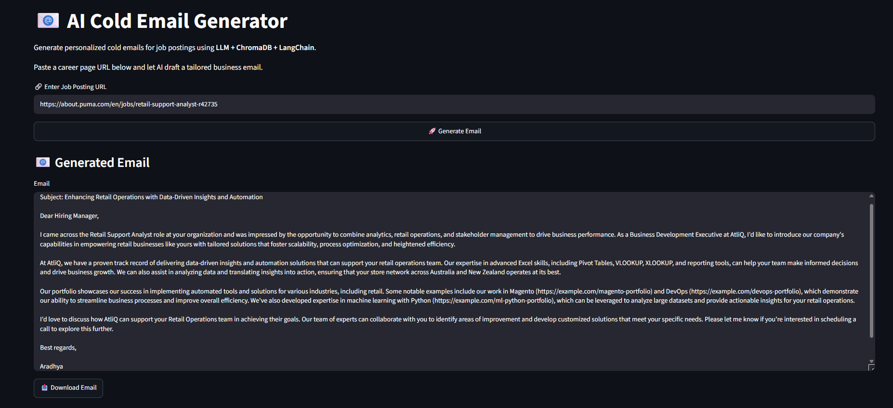

# 📧 Cold Mail Generator

An end-to-end Generative AI application that turns a company's careers page into a personalized, ready-to-send cold outreach email.

---

## 🔍 Project Overview

**Cold Mail Generator** is a Generative AI application built for services/software companies (modeled here on a company like **AtliQ**) that want to reach out to potential clients through relevant job openings.

Instead of manually browsing a company's careers page, reading through job descriptions, and drafting a custom outreach email for every opening, this application automates the entire pipeline:

- It **extracts job listings** from a company's careers page URL
- It **processes the job description** to understand the underlying business need
- It **retrieves relevant portfolio links** from a vector database that best match the job's requirements
- It uses an **LLM (via Groq + LangChain)** to generate a personalized cold email referencing those requirements and portfolio items

**Why this is hard to do manually:** writing a *good* cold email isn't just filling in a template — it requires reading the job posting carefully, understanding what the hiring company actually needs, and then connecting that need to *specific, relevant* proof of work. Doing this by hand for every lead is slow, repetitive, and inconsistent — most manually written cold emails end up generic because researchers run out of time to personalize each one. This project automates that research-and-personalization loop.

---

## 🧭 Real-World Scenario

**Example:** PUMA has a **"Retail Support Analyst"** opening.

**Job URL:**
`https://about.puma.com/en/jobs/retail-support-analyst-r42735`

The workflow:

1. A Business Development Executive pastes the PUMA careers URL into the app
2. The app extracts the job listing and its description
3. It analyzes the requirements (e.g., data analysis, retail operations, stakeholder management)
4. It searches a vector database of portfolio projects for the closest matches
5. It generates a personalized email connecting AtliQ's relevant work to PUMA's specific needs

**Flow:**

```
PUMA Careers URL
       ↓
Extract "Retail Support Analyst" Job Listing
       ↓
Identify Requirements (data analysis, retail ops, stakeholder mgmt)
       ↓
Retrieve Matching Portfolio Links (vector search)
       ↓
Generate Personalized Cold Email (Groq LLM)
```

---

## ❓ Problem Statement

The traditional manual business-development workflow looks like this:

1. A BD executive browses a company's careers page
2. They manually read and interpret job requirements
3. They manually recall or search for relevant portfolio projects to reference
4. They manually draft a personalized email
5. This is repeated, one email at a time, for every lead

**Cold Mail Generator automates steps 1–4** by combining web extraction, requirement analysis, vector-based portfolio retrieval, and LLM-based email generation into a single Streamlit workflow — leaving the BD executive to simply review and send.

---

## ✨ Key Features

- 🔗 Careers-page URL input
- 📄 Job listing extraction from the provided page
- 🧠 Job-description processing to identify key requirements
- 🎯 Requirement identification from unstructured job text
- 🔍 Portfolio retrieval using vector similarity search (ChromaDB)
- ✉️ Personalized cold email generation via an LLM
- 🖥️ Simple Streamlit web interface

---

## 🏗️ System Architecture

```
Company Careers URL
       ↓
Job Listing Extraction
       ↓
Job Description
       ↓
Requirement Analysis
       ↓
ChromaDB / Vector Search
       ↓
Relevant Portfolio Links
       ↓
LangChain Prompt Workflow
       ↓
Groq LLM
       ↓
Personalized Cold Email
       ↓
Streamlit UI
```

---

## ⚙️ How the Application Works

1. **URL Input** — The user pastes a company's careers page URL into the Streamlit UI.
2. **Job Extraction** — The app fetches the page and extracts the job listing(s) present on it.
3. **Requirement Understanding** — The extracted job description is passed to the LLM pipeline (via LangChain) to identify the key skills and requirements the role is asking for.
4. **Vector Search** — Those requirements are used to query ChromaDB, which stores portfolio project embeddings, to retrieve the portfolio links most semantically similar to what the job needs.
5. **Email Generation** — LangChain assembles a prompt combining the job context and the retrieved portfolio links, and sends it to Groq's LLM to generate a complete, personalized cold email.
6. **Display** — The final email is rendered back in the Streamlit interface for the user to review and copy.

---

## 🛠️ Tech Stack

| Technology | Purpose |
|---|---|
| **Python** | Core programming language for the application logic |
| **Groq** | LLM inference provider — generates the cold email content |
| **LangChain** | Orchestrates prompts, chains, and connects the LLM to retrieval and extraction steps |
| **ChromaDB** | Vector database storing portfolio project embeddings for similarity search |
| **Streamlit** | Web interface for entering the careers URL and viewing the generated email |
| **python-dotenv** | Loads environment variables (like the Groq API key) from a `.env` file |

---

## 🧠 Generative AI Concepts

- **LLMs (Large Language Models):** The core generation engine — in this project, an LLM hosted on Groq is used to compose the final email text.
- **Prompt Engineering:** The prompts passed to the LLM are structured to include the job requirements and retrieved portfolio links, guiding the model to produce a relevant, personalized response rather than a generic one.
- **Vector Databases:** ChromaDB stores portfolio entries as vector embeddings, enabling fast similarity search instead of keyword matching.
- **Embeddings / Semantic Similarity:** Job requirements are compared against portfolio embeddings to find conceptually related work, not just exact keyword matches.
- **Retrieval-Augmented Generation (RAG):** This project uses a *retrieval step* (vector search over portfolio links) to inform the *generation step* (the LLM writing the email). It's a lightweight, applied form of retrieval-augmented generation — the retrieved portfolio context is injected into the prompt rather than the model relying purely on its own training knowledge.
- **LLM Orchestration with LangChain:** LangChain ties the extraction, retrieval, and generation steps together into a coherent pipeline, rather than each step being handled by disconnected scripts.

---

## 🔁 Portfolio Retrieval

Portfolio links are retrieved dynamically based on each job's specific requirements rather than reusing the same set of links in every email. This matters because a generic, one-size-fits-all portfolio reference reads as impersonal and often irrelevant to the recipient's actual needs. By running a vector similarity search against the job's requirements, the app surfaces the portfolio projects that are *most contextually relevant* to that specific role — e.g., a retail-analytics role surfaces retail/data-related work rather than unrelated projects — which makes the resulting email feel researched rather than templated.

---

## 💡 Example

**Input:**
PUMA "Retail Support Analyst" careers URL

**Pipeline:**
Job requirements extracted → Relevant portfolio links retrieved via vector search → LLM generates email

**Shortened Output Example:**

```
Subject: Enhancing Retail Operations with Data-Driven Insights and Automation

Dear Hiring Manager,

I came across the Retail Support Analyst role at your organization and
was impressed by the opportunity to combine analytics, retail operations,
and stakeholder management to drive business performance...

Our portfolio showcases our capabilities in developing and implementing
automated tools for various industries, including retail...

Best regards,
Mohan
Business Development Executive
AtliQ
```

---

## 📁 Project Structure

```
cold-mail-generator/
│
├── app/
│   ├── resource/            # Portfolio data used for vector search (e.g. portfolio CSV)
│   ├── chains.py            # LangChain prompt chains for extraction & email generation
│   ├── main.py               # Streamlit application entry point
│   ├── portfolio.py          # Portfolio loading & vector database (ChromaDB) logic
│   └── utils.py               # Helper/utility functions
│
├── Output.png                # Application UI screenshot
├── requirements.txt          # Python dependencies
├── .env                        # API keys — must NOT be committed to GitHub

```

**Code breakdown:**

| File | Role |
|---|---|
| `main.py` | Streamlit UI — takes the careers URL as input and displays the generated email |
| `chains.py` | Defines the LangChain prompt chains used to extract job details and generate the email via Groq |
| `portfolio.py` | Loads portfolio data and handles the ChromaDB vector store and similarity search |
| `utils.py` | Shared helper functions used across the app |
| `resource/` | Holds the portfolio data (e.g. a CSV of project links) used to build the vector database |

---

---

## 🚀 Installation and Setup

```bash
# 1. Create and activate a virtual environment
python -m venv .venv
source .venv/bin/activate      # On Windows: .venv\Scripts\activate

# 2. Install dependencies
pip install -r requirements.txt

# 3. Set up your Groq API key
# Create a .env file in the project root and add:
GROQ_API_KEY=your_api_key_here

# 4. Run the application
streamlit run app/main.py
```

---

## 🔐 Security

API keys and other secrets must **never** be committed to GitHub. Store them only in your local `.env` file, which should always be excluded from version control.


---

## 🖼️ Screenshot of Output





---

## 💼 Business Value

This project is aimed at teams that rely on personalized outreach as part of their growth strategy:

- **Business development teams** — cuts down the time spent researching each lead's job postings before reaching out
- **Sales/outreach teams** — enables sending more personalized emails at scale without sacrificing relevance
- **Service companies** — helps match a company's own capabilities/portfolio to a prospect's stated needs automatically
- **Recruiter/client outreach** — reduces repetitive manual research when reaching out based on public job listings

The core value is reducing the manual research-and-writing bottleneck while keeping each email relevant to the specific role being referenced.

---

## 🔮 Future Improvements

- Better/more robust job-page parsing across different careers-page formats
- Support for multiple email tones (formal, casual, concise, etc.)
- Gmail integration for direct sending
- In-app email editing before sending
- Email history/tracking
- More advanced retrieval strategies (re-ranking, hybrid search)
- Deployment to a hosted environment

*(None of the above are currently implemented — this app currently runs locally via Streamlit.)*

---

## 📚 Learning Outcomes

Building this project helped me gain hands-on experience with:

- End-to-end Generative AI application development
- Building LLM pipelines with **LangChain**
- Using the **Groq API** for fast LLM inference
- Working with **vector databases** (ChromaDB)
- Semantic retrieval and embedding-based search
- Prompt engineering for structured, context-aware outputs
- Building interactive UIs with **Streamlit**
- Connecting extraction, retrieval, and generation into one working GenAI workflow

---

## 🙏 Acknowledgements

This project was built by following and adapting the **Codebasics Cold Mail Generator** project as a learning exercise. It is not presented as a fully original concept — it reflects my implementation and understanding of that project's approach, built to deepen my hands-on experience with LLM application development.

---

## 👤 Author

**Aradhya Trehan**
B.Tech — Computer Science & Engineering (AI/ML)
GitHub: [@aradhyatrehan20](https://github.com/aradhyatrehan20)
